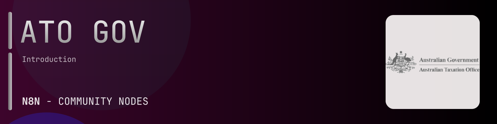

# @n8n-dev/n8n-nodes-ato-gov



[](https://www.npmjs.com/package/@n8n-dev/n8n-nodes-ato-gov)
[](https://opensource.org/licenses/MIT)

---

**Stop writing ato-gov API integrations by hand.**

Every time you connect n8n to ato-gov, you waste hours mapping endpoints, defining parameters, and debugging schemas. You copy-paste from docs, fix edge cases, and pray nothing breaks.

**What if connecting n8n to ato-gov took 5 minutes, not half a day?**

This node gives you **26+ resources** out of the box: **Individuals**, **Individuals Roles**, **Individuals Addresses**, **Individuals Electronic Addresses**, **Individuals Business Names**, and 21 more: with full CRUD operations, typed parameters, and zero manual configuration.

---

## What You Get

- **Zero boilerplate**: Resources, operations, and fields are pre-configured and ready to use
- **Full CRUD**: Create, read, update, and delete support where the API allows it
- **Typed parameters**: No more guessing field types
- **Built-in auth**: API key authentication, ready to go
- **Declarative**: Native n8n performance, no custom execute() overhead

---

## Install

```bash
npm install @n8n-dev/n8n-nodes-ato-gov
```

**Or in n8n:**
1. **Settings → Community Nodes → Install**
2. Search: `@n8n-dev/n8n-nodes-ato-gov`
3. Click **Install**

---

## Quick Start

1. Install the node (above)
2. Add credentials: **ato-gov API** → paste your API key
3. Drag the **ato-gov** node into your workflow
4. Pick a resource → pick an operation → done.

That's it. No configuration files. No code. It just works.

---

## Resources

<details>
<summary><b>Individuals</b> (4 operations)</summary>

- Get Retrieve a list of individuals
- Post Create an individual
- Delete an individual
- Put Update an individual

</details>

<details>
<summary><b>Individuals Roles</b> (4 operations)</summary>

- Get Retrieve a list of roles
- Post Create a role
- Delete a role
- Put Update a role

</details>

<details>
<summary><b>Individuals Addresses</b> (4 operations)</summary>

- Get Retrieve a list of addresses
- Post Create an address
- Delete an address
- Put Update an address

</details>

<details>
<summary><b>Individuals Electronic Addresses</b> (4 operations)</summary>

- Get Retrieve a list of electronic addresses
- Post Create an electronic address
- Delete an electronic address
- Put Update an electronic address

</details>

<details>
<summary><b>Individuals Business Names</b> (4 operations)</summary>

- Get Retrieve a list of business names
- Post Create a business name
- Delete a business name
- Put Update a business name

</details>

<details>
<summary><b>Individuals Licenses</b> (4 operations)</summary>

- Get Retrieve a list of licenses
- Post Create a license
- Delete a license
- Put Update a license

</details>

<details>
<summary><b>Organisations</b> (4 operations)</summary>

- Get Retrieve a list of organisations
- Post Create an organisation
- Delete an organisation
- Put Update an organisation

</details>

<details>
<summary><b>Organisations Roles</b> (4 operations)</summary>

- Get Retrieve a list of roles
- Post Create a role
- Delete a role
- Put Update a role

</details>

<details>
<summary><b>Organisations Addresses</b> (4 operations)</summary>

- Get Retrieve a list of addresses
- Post Create an address
- Delete an address
- Put Update an address

</details>

<details>
<summary><b>Organisations Electronic Addresses</b> (4 operations)</summary>

- Get Retrieve a list of electronic addresses
- Post Create an electronic address
- Delete an electronic address
- Put Update an electronic address

</details>

<details>
<summary><b>Organisations Business Names</b> (4 operations)</summary>

- Get Retrieve a list of business names
- Post Create a business name
- Delete a business name
- Put Update a business name

</details>

<details>
<summary><b>Organisations Licenses</b> (4 operations)</summary>

- Get Retrieve a list of licenses
- Post Create a license
- Delete a license
- Put Update a license

</details>

<details>
<summary><b>Business Names</b> (1 operations)</summary>

- Get Retrieve a list of business names

</details>

<details>
<summary><b>Licenses</b> (1 operations)</summary>

- Get Retrieve a list of licenses

</details>

<details>
<summary><b>Business Name Lifecycle States</b> (1 operations)</summary>

- Get Retrieve a list of business name lifecycle states

</details>

<details>
<summary><b>Name Directions</b> (1 operations)</summary>

- Get Retrieve a list of name directions

</details>

<details>
<summary><b>Name Prefixes</b> (1 operations)</summary>

- Get Retrieve a list of name prefixes

</details>

<details>
<summary><b>Name Types</b> (1 operations)</summary>

- Get Retrieve a list of name types

</details>

<details>
<summary><b>Address Types</b> (1 operations)</summary>

- Get Retrieve a list of address types

</details>

<details>
<summary><b>Electronic Address Types</b> (1 operations)</summary>

- Get Retrieve a list of electronic address types

</details>

<details>
<summary><b>Genders</b> (1 operations)</summary>

- Get Retrieve a list of genders

</details>

<details>
<summary><b>Legal Entity Types</b> (1 operations)</summary>

- Get Retrieve a list of legal entity types

</details>

<details>
<summary><b>License Lifecycle States</b> (1 operations)</summary>

- Get Retrieve a list of license lifecycle states

</details>

<details>
<summary><b>License Types</b> (1 operations)</summary>

- Get Retrieve a list of license types

</details>

<details>
<summary><b>Registered Identifier Types</b> (1 operations)</summary>

- Get Retrieve a list of registered identifier types

</details>

<details>
<summary><b>Roles</b> (1 operations)</summary>

- Get Retrieve a list of roles

</details>

---

## Why This Node?

**Without this node:**
- Hours of manual API integration
- Copy-pasting from ato-gov docs
- Debugging auth, pagination, error handling
- Maintaining your own client code

**With this node:**
- Install → configure → use. 5 minutes.
- Auto-generated from the official ato-gov OpenAPI spec
- Always up to date when the API changes
- Native n8n performance

---

## Auto-Generated
This node was auto-generated from the official **ato-gov** OpenAPI specification using
[@n8n-dev/n8n-openapi-node-ultimate](https://github.com/kelvinzer0/n8n-openapi-node-ultimate),
then validated against the live API so you get accurate types and real parameters, not guesswork.

When the ato-gov API updates, this node updates too.

---


## License

MIT © [kelvinzer0](https://github.com/n8n-code)
